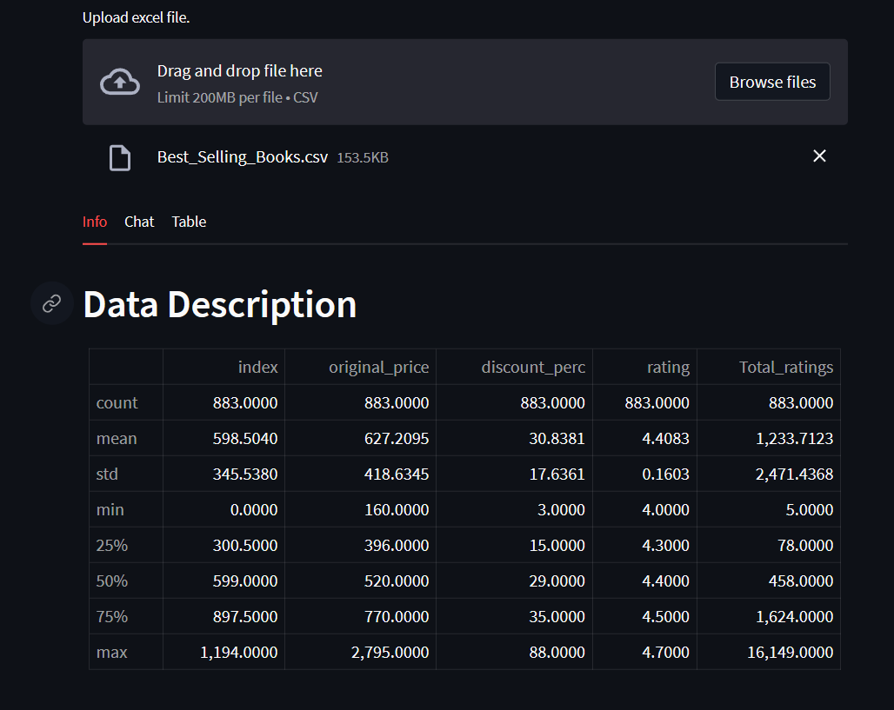

## Prompt Based Data Analytics<br>
Streamlit app to analyse tabular data using prompts<br>



## Setup<br>
1. Install dependencies in your virtual environment.<br>
<t>```pip install -r requirements.txt```<br>

1. Run streamlit app.<br>
```streamlit run main.py```<br>